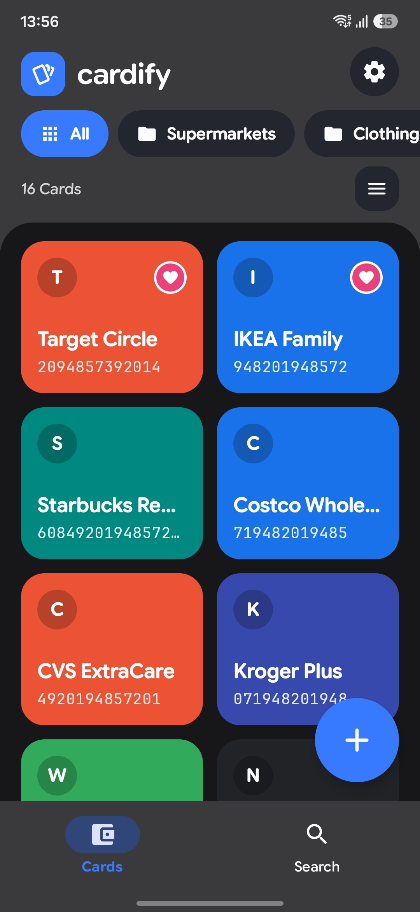
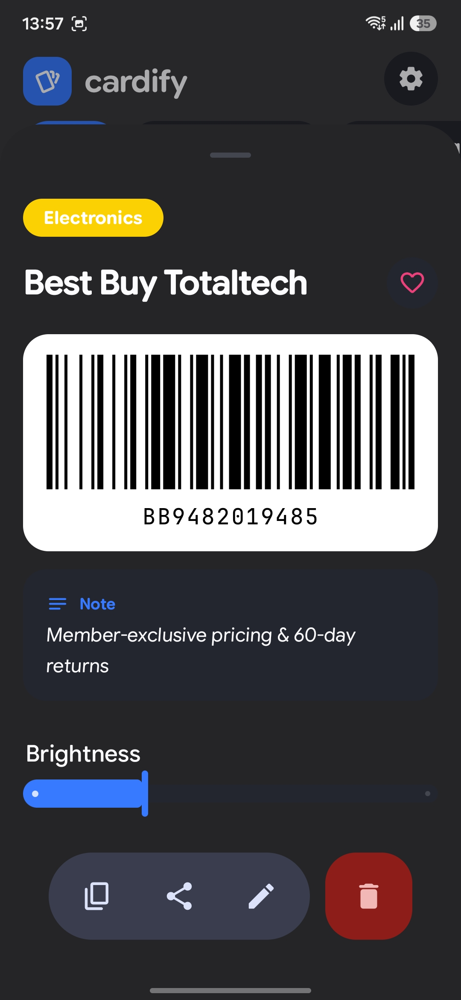
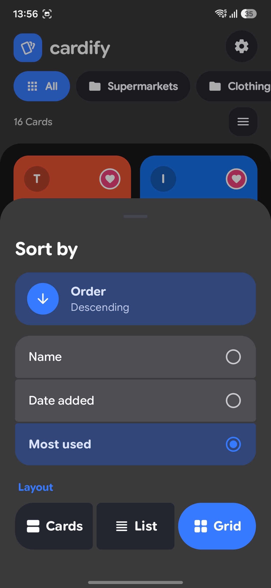
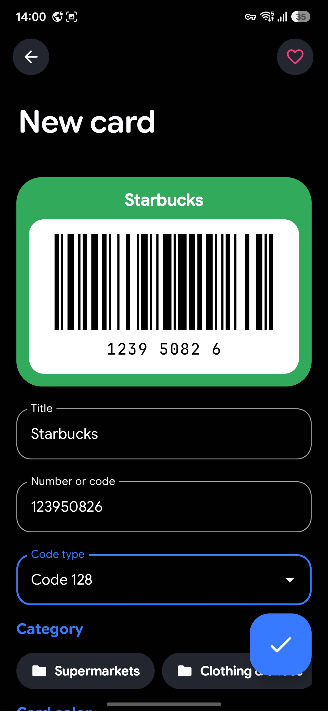
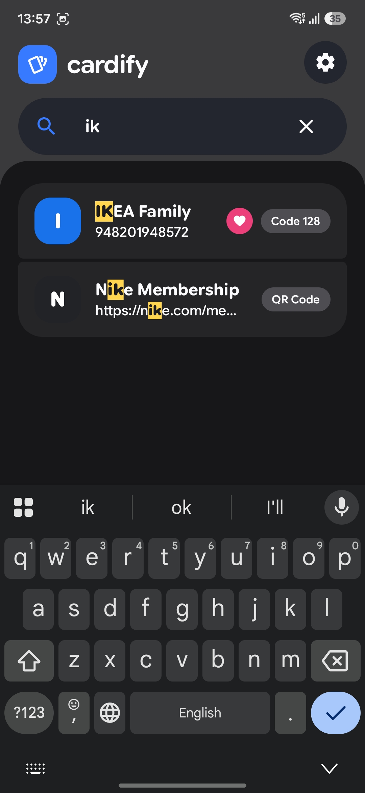
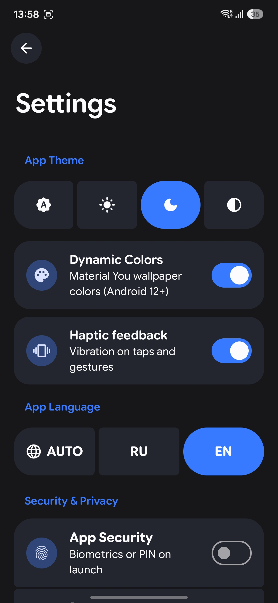

<div align="center">

  <h1>💳 Cardify</h1>

  <p><strong>A modern, private, and 100% offline loyalty & discount card wallet for Android.</strong></p>

  <p>
    <a href="https://github.com/ilya33gh/cardify/releases"></a>
    <a href="LICENSE"></a>
    
    
    <a href="https://developer.android.com"></a>
    <a href="https://developer.android.com/jetpack/compose"></a>
  </p>

</div>

---

## 📱 About Cardify

**Cardify** is an open-source, privacy-first Android application designed to digitize and store all your loyalty cards, store passes, discount vouchers, and memberships in one elegant, unified wallet.

Built from the ground up with **Jetpack Compose** and **Material 3 Expressive (Material You)**, Cardify requires **no account registration**, has **no internet permission**, and stores all your data securely on your local device.

---

## 📸 Screenshots

<div align="center">

| 💳 Wallet & Favorites | ⚡ Card Details & Barcode | 📊 Sort & Layout Menu |
| :---: | :---: | :---: |
|  |  |  |
| **Grid View with Monet Colors** | **Full Barcode & Brightness Control** | **Expressive M3 Bottom Sheet** |

| ✍️ Add / Edit Card | 🔍 Real-time Search | 🔒 Settings & Security |
| :---: | :---: | :---: |
|  |  |  |
| **Live Barcode Generator** | **Visual Match Highlighting** | **Themes, Biometrics & Auto-lock** |

</div>

---

## ✨ Features

- 🛡️ **100% Offline & Private by Design**:
  - Zero network permissions (`android.permission.INTERNET` is not declared).
  - No trackers, no analytics, no ads, and no third-party cloud synchronization.

- ⚡ **Fullscreen POS Barcode Checkout Mode**:
  - Tap any card's barcode to open a high-contrast, 90°-rotated vertical view.
  - Automatically raises screen brightness to **100%** for instant scanning at grocery and retail checkouts.

- 🎨 **Material 3 Expressive & Monet Dynamic Theming**:
  - Full support for Android 12+ dynamic system colors (**Monet**).
  - Clean Light mode, high-contrast Dark mode, and battery-saving **OLED Pure Black** mode.
  - Smooth spring physics animations and subtle tactile haptics.

- 📊 **Customizable Layout & Smart Sorting**:
  - Switch between **Cards**, compact **List rows**, and **Grid** view modes.
  - Sort by **Name** (with intelligent Latin & Cyrillic collation), **Date added**, or **Frequency of use** (Most used).
  - Quick-toggle between **Ascending** and **Descending** order with a rotating bottom-sheet action.

- 🔍 **Dedicated Search Experience**:
  - Real-time search with visual matching highlight across card titles, notes, and categories.
  - Seamless non-linear sliding animations between wallet and search.

- 🔒 **Biometric Security & App Lock**:
  - Protect your cards with **Fingerprint, Face Unlock, or PIN**.
  - Configurable auto-lock timeouts (*Immediately*, *1 minute*, *5 minutes*).
  - Optional **Recent Apps Protection** (`FLAG_SECURE`) to prevent screen previews and screenshots.

- 📷 **Real-time Camera Scanner**:
  - Fast barcode recognition for **EAN-13, EAN-8, UPC-A, UPC-E, Code 128, Code 39, Code 93, ITF, QR Code, Data Matrix, Aztec, PDF-417**.
  - Import barcodes directly from device gallery or document files.

- ✅ **Built-in Barcode Validation**:
  - Live format verification with helpful hints and error warning haptics to prevent broken cards from being saved.

- 💾 **Local Backup & Restore**:
  - Export and import your entire card database to/from local encrypted JSON files.

---

## 🌿 FOSS & Google Versions

Cardify is distributed in two flavors to suit all users:

| Flavor / Branch | Scanner Engine | Google Dependencies | Target Distribution |
| :--- | :--- | :--- | :--- |
| **`foss`** | Pure **ZXing** + CameraX | **Zero** (100% Open Source) | [F-Droid](https://f-droid.org), GrapheneOS, LineageOS |
| **`google`** / **`main`** | **Google ML Kit** | Google Play Services Barcode SDK | GitHub Releases, Google Play |

---

## 🛠 Tech Stack

- **Language**: [Kotlin 2.0](https://kotlinlang.org/)
- **UI Framework**: [Jetpack Compose](https://developer.android.com/jetpack/compose) with Material 3 Expressive
- **Architecture**: Modern Android Architecture / MVVM (`StateFlow`, Coroutines)
- **Local Database**: [Room ORM](https://developer.android.com/training/data-storage/room) (SQLite)
- **Camera & Barcode Processing**:
  - [CameraX](https://developer.android.com/training/camerax) — Camera hardware management
  - [ZXing Core](https://github.com/zxing/zxing) — Open-source barcode rasterization & FOSS scanner
  - [Google ML Kit](https://developers.google.com/ml-kit) — Google-flavor scanning engine
- **Security**: AndroidX Biometric + Window `FLAG_SECURE`
- **Build System**: Gradle Version Catalogs (`libs.versions.toml`) & KSP

---

## 🚀 Building from Source

### Prerequisites
- **Android Studio**: Ladybug (2024.2.1) or newer
- **JDK**: 21
- **Android SDK**: Compile SDK 35, Min SDK 26 (Android 8.0+)

### Setup

```bash
# 1. Clone the repository
git clone https://github.com/ilya33gh/cardify.git
cd cardify

# 2. Build FOSS release APK (for F-Droid)
git checkout foss
./gradlew assembleRelease

# 3. Build Google flavor release APK
git checkout google
./gradlew assembleRelease
```

The resulting APK files will be generated in `app/build/outputs/apk/release/`.

---

## 📄 License

This project is open-source and licensed under the [MIT License](LICENSE).
